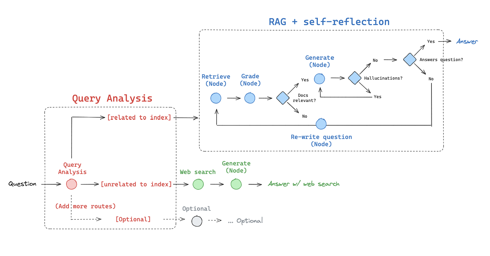

01 LangChain入門
===
安裝套件
---
pip install 
---
- langchain 
- langchain_community

額外安裝
---
- Ollama (cmd:ollama run llama2)

重點
---
- chain的基本組成: prompt | llm
- 視需求於chain末端添加output parser微調輸出文字內容
- 賦予模型系統指令: 於prompt內添加('system':'系統指令')
>- ex: ("system", "You are a content manager with extensive SEO knowledge. Your task is to write an article based on a given title.")

02 Retrive預先提供的documnets
===
安裝套件
---
pip install 
---
- langchain 
- faiss-cpu

額外安裝
---
- Ollama (cmd:ollama run llama2)

重點
---
- 讓模型能讀取模型之外的資料
- 將外部資料進行embedding並透過FAISS存入VectorDB
- 使用as_retriever告訴模型要用什麼方式檢索那些資料(預設以相似度)

03 Retrive歷史對話
===

重點
---
- 除了建立外部資訊的vectorDB外，為了讓模型能檢索歷史對話紀錄，需使用MessagesPlaceholder(variable_name='chat_history')，告訴模型從對話紀錄中產生query用於後續生成使用
- 使用create_history_aware_retriever()建立一個可以檢索對話紀錄的chain
- 最後使用retrieval_chain = create_retrieval_chain(retriever_chain, document_chain)將檢索對話紀錄與檢索外部資訊的chain整合
- 對話紀錄使用chat_history list儲存
>- 如果是人類的訊息就用 HumanMessage 類別、如果是 AI 的訊息就用 AIMessage
- 最後chain.invoke時，除了使用者輸入外還要將chat_history變數一併輸入
- ref: https://vijaykumarkartha.medium.com/beginners-guide-to-conversational-retrieval-chain-using-langchain-3ddf1357f371

04 Agents應用
===
安裝套件
---
pip install 
---
- langchain 
- langchain-openai 
- langchainhub

額外需求
---
- 由於使用OpenAI的模型實作Agents門檻相對低也要方便，故在此使用OpenAI模型進行後續作業
- 需至 OpenAI Platform 申請 1 組 API key並以環境變數方式建立
- ref: https://help.openai.com/en/articles/5112595-best-practices-for-api-key-safety

重點
---
- 載入OpenAI模型gpt-3.5-turbo
- 定義工具，撰寫python function呼叫requests.get()並回傳bool
>- 需使用@tool裝飾子進行轉換
>- 函式的docstring 必須要提供，否則會報錯
>- 根據官方文件，參數的部分建議最好也提供型別註釋(Type hints)
- 綁定工具與語言模型
>- llm_with_tools = llm.bind_tools(tools)
- 定義prompt，其中必須提供MessagesPlaceholder(variable_name="agent_scratchpad")，因Agent會用agent_scratchpad儲存中間步驟相關資訊
- 建立Agent，參考官方文件使用ormat_to_openai_tool_messages() 函式將 x["intermediate_steps"] 轉成 OpenAI 所需要的格式
- 建立Agent Executor
>- agent_executor = AgentExecutor(agent=agent, tools=tools, verbose=True)
>- 若不想看到debug資訊可以將verbose設為False
- 若想讓機器人能記錄上下文，只須於prompt內加入MessagePlaceholder並於agent內帶入chat_history變數以及將chat_history的list append對話紀錄
- 使用prompt = hub.pull('hwchase17/openai-functions-agent')抓取LangChain Hub上的prompt

05 動態變更chain的參數設定
===
安裝套件
---
pip install 
---
- langchain 

額外安裝
---
- Ollama (cmd:ollama pull codellama)

重點
---
- 為了動態變更llm的temperature參數，在Ollama(model='llama2', temperature=0)後呼叫configurable_fields，將 temperature參數設定為ConfigurableField，將其命名為llm_temperature
- 使用chain時，額外呼叫with_config()方法並進行llm_temperature設定
- 若想要更換Ollma以外的語言模型時，需使用configurable_alternatives()
>- ex:llm = Ollama(model='llama2').configurable_alternatives(
    ConfigurableField(id="llm"),
    default_key='llama2',
    gpt35=ChatOpenAI(model="gpt-3.5-turbo", temperature=0),
)
- 變更prompt
>- prompt = PromptTemplate.from_template(
    "Tell me a joke about {topic}"
).configurable_alternatives(
    ConfigurableField(id="prompt"),
    default_key="joke",
    poem=PromptTemplate.from_template("Write a short poem about {topic}"),
)

05_2 動態變更不同使用者的id及對話紀錄
===

重點
---
- 於RunnableWithMessageHistory()內增加history_factory_config()參數，並將user_id、conversation_id以ConfigurableFieldSpec()進行設定
- get_chat_history須作相對修改
- 最後在chain呼叫的時候將參數帶入
>- with_message_history.with_config(
    configurable={
        'user_id': user_id,
        'conversation_id': conversation_id
    }
).invoke({'input': input_text})

06 LangServe API 伺服器
===
安裝套件
---
pip install 
---
- langchain 
- faiss-cpu 
- "langserve[all]" 
- pydantic==1.10.13

額外安裝
---
- Ollama (cmd:ollama run llama2)

重點
---
- 使用add_routes()將FastAPI的instance與chain進行綁定
- 存取API說明文件 http://localhost:9000/doc
- configurable參數一樣可以顯示在Playground上
- 可以透過llama2 = RemoteRunnable("http://localhost:9000/llama2/")方式將REST API server轉成Runnable於本地端使用

07 prompt長度控制
===
安裝套件
---
pip install 
---
- langchain 
- transformers

額外安裝
---
- Ollama (cmd:ollama run llama2)

重點
---
- condense_prompt()函式對傳進來的ChatPromptValue進行長度檢查若超過500就只保留前2個messages，然後從剩下的messages再扣掉前2個，然後和一開始保留的2個messages加總，檢查是否長度大於500，若小於500則將合成結果輸出，若大於500則繼續扣除2個messages
- 為何都是以2為單位扣除messages，因為一次可以扣掉1個HumanMessage和1個AIMessage
- chat_history必須在condense_prompt()內進行更新，避免丟掉的對話紀錄重新回到prompt中

08 文件下載器及分割器
===
安裝套件
---
pip install 
---
- langchain 
- beautifulsoup4

額外安裝
---
- Ollama (cmd:ollama run llama2)

重點
---
- 透過WebBaseLoader下載新聞內容並轉換為document
>- loader = WebBaseLoader("https://edition.cnn.com/2024/03/06/tech/openai-elon-musk-emails/index.html")
documents = loader.load()
- 實例RecursiveCharacterTextSplitter用於文本分割
>- 常用參數
>>- chunk_size
>>- chunk_overlap
- 將文本分割的好處:
>- 可以克服 Tokens 數量上限的問題
>- 讓語言模型可以專注在夠小的 chunks 上，而且在 Retrieval 階段，不相干/不相似的 chunks 的更容易被排除在外，進而提升語言模型的回答準確度/品質

09 LangChain做SQL搜尋機器人
===
安裝套件
---
pip install 
---
- langchain 
- SQLAlchemy

額外安裝
---
- Ollama (cmd:ollama run llama2)
- 隨意.db檔

重點
---
- 使用2次prompt
>- 第一次prompt藉由輸入問題及DB的schema使模型生成SQL語法指令
>- 第二次prompt以使用者問題、經由第一次prompt得到的SQL語法、使用SQL語法進行資料庫查找的結果作為參數，使模型生成答案
- 重點程式:
>- chain = (
    RunnablePassthrough.assign(query=gen_query_chain).assign(
        result=lambda x: run_query(x["query"]),
    )
    | gen_answer_prompt
    | llm
)
>- 首先將使用者input透過RunnablePassthrough.assign(query=gen_query_chain)產生prompt內的query變數，再將query變數送到assign( result=lambda x: run_query(x["query"]), )產生SQL搜尋結果result變數，最後將input、query、result輸入語言模型生成最後答案

CRAG Flow Chart
===

- ref:https://langchain-ai.github.io/langgraph/tutorials/rag/langgraph_crag/

SRAG Flow Chart
===

- ref:https://langchain-ai.github.io/langgraph/tutorials/rag/langgraph_self_rag/

ARAG Flow Chart
===

- ref:https://langchain-ai.github.io/langgraph/tutorials/rag/langgraph_adaptive_rag/
